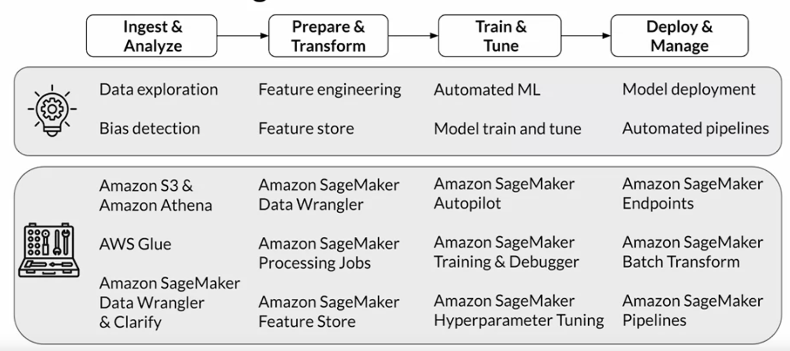

# Practical Data Science on the AWS Cloud Specialization

## About

Development environments might not have the exact requirements as production environments. Moving data science and machine learning projects from idea to production requires state-of-the-art skills. You need to architect and implement your projects for scale and operational efficiency. Data science is an interdisciplinary field that combines domain knowledge with mathematics, statistics, data visualization, and programming skills.

The Practical Data Science Specialization brings together these disciplines using purpose-built ML tools in the AWS cloud. It helps you develop the practical skills to effectively deploy your data science projects and overcome challenges at each step of the ML workflow using Amazon SageMaker.

This Specialization is designed for data-focused developers, scientists, and analysts familiar with the Python and SQL programming languages who want to learn how to build, train, and deploy scalable, end-to-end ML pipelines - both automated and human-in-the-loop - in the AWS cloud.

Each of the 10 weeks features a comprehensive lab developed specifically for this Specialization that provides hands-on experience with state-of-the-art algorithms for natural language processing (NLP) and natural language understanding (NLU), including BERT and FastText using Amazon SageMaker.

[Course Link](https://www.coursera.org/specializations/practical-data-science)

## Learning Objectives

- Prepare data, detect statistical data biases, perform feature engineering at scale to train models, & train, evaluate, & tune models with AutoML
- Store & manage ML features using a feature store, & debug, profile, tune, & evaluate models while tracking data lineage and model artifacts
- Build, deploy, monitor, & operationalize end-to-end machine learning pipelines
- Build data labeling and human-in-the-loop pipelines to improve model performance with human intelligence

## Specializations

| No  |                                       Course Folder                                       | Date Completed |
| :-: | :---------------------------------------------------------------------------------------: | :------------: |
|  1  |     [Analyze Datasets and Train ML Models using AutoML](https://tinyurl.com/2dslrxx5)     |  In Progress   |
|  2  |     [Build, Train, and Deploy ML Pipelines using BERT](https://tinyurl.com/2qywpem6)      |       -        |
|  3  | [Optimize ML Models and Deploy Human-in-the-Loop Pipelines](https://tinyurl.com/2mkugzaa) |       -        |
